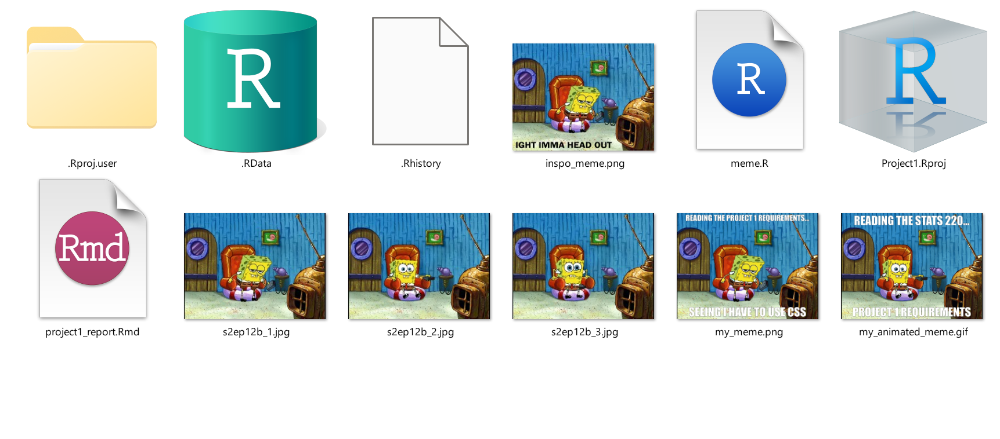
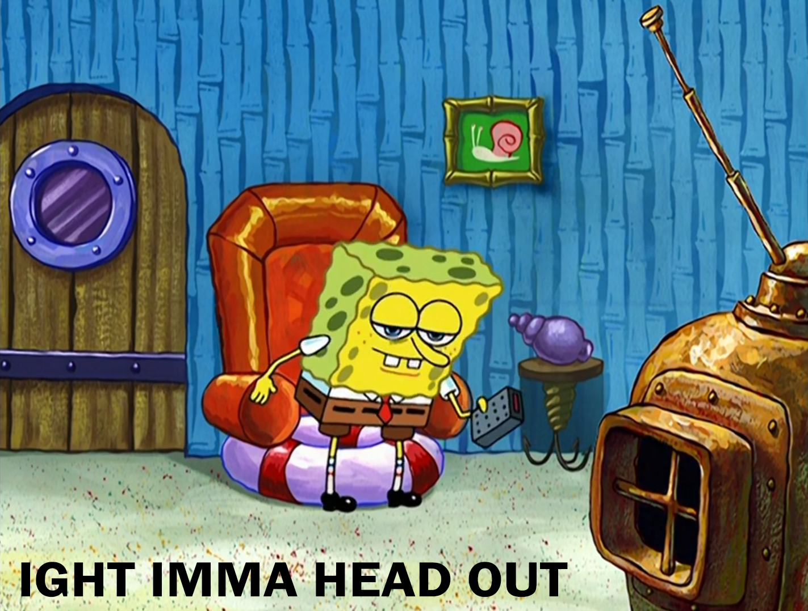
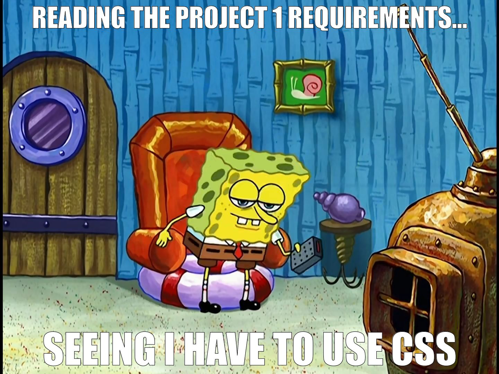
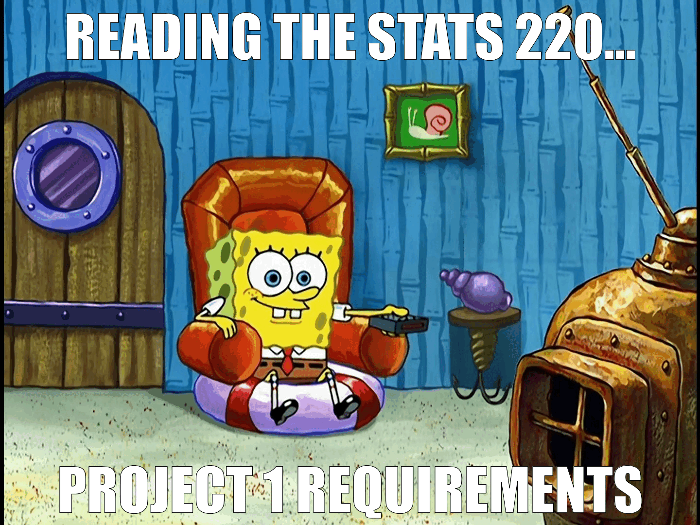

```{r setup, include=FALSE}
knitr::opts_chunk$set(echo=TRUE, message=FALSE, warning=FALSE, error=FALSE)
```

```{css}
@import url('https://fonts.googleapis.com/css2?family=Source+Sans+3:ital,wght@0,200..900;1,200..900&display=swap');

body {
  background-color: #F7F6E5;
  font-family: 'Source Sans 3', sans-serif;
}

h2 {
  color: #DA4848;
  border-bottom: 2px solid #DA4848;
  font-weight: 700;
}

h3 {
  color: #76D2DB;
  border-bottom: 2px solid #76D2DB;
  font-weight: 550;
}

p {
  font-weight: 400;
}
```

## Project requirements

The link to my GitHub stats220 repo: 
[My STATS 220 GitHub Repo](https://github.com/Pitiedwzr/stats220)

## Inspo meme


### Key Components
The character SpongeBob is getting up from a chair. A bold black text on the bottom left that says "IGHT IMMA HEAD OUT", shows the character want to escape from it.

## My meme


### Changes I did
For my meme, I keep the base image but change the text to "READING THE PROJECT 1 REQUIREMENTS...SEEING I HAVE TO USE CSS", and the style of the text.

### Explanations of changes
I made this change because it's my reaction of seeing I have to use CSS. Although I'm a computer science major, I still don't like writing CSS, so I want to make a joke about the project requirements. I also change the font to "Impact" because it's the classic meme font.

## My animated meme 


## Creativity
In this project, I tried to show creativity in several ways:
- In the `image_annotate` function, I used `strokecolor` to add a black outline for the text, to make it readable.
- For the animated meme, I used different base image with text to create a progressive narrative. 
- I used the function `image_colorize` in the third frame to add a red "filter" to the image for the feeling of panic.
- I used `border-bottom` for headers in CSS to add a border for headers to improve readability of the document.
- Related to my personal context as a Computer Science student who dislikes CSS seeing CSS is one of the requirements for this project, this adds meta-humor for this meme.

## Learning reflection
### Important Idea
One important idea I learned from this module is how to combine different tools, including RStudio, markdown and CSS into one project, I found out it is important to use multiple tools and technologies to demonstrate a clear, tidy report document.

### Curious about data technology
Now, I'm highly curious about using R in Machine Learning and Data Science. As a Computer Science student, I already know that Python is very popular in Computer Science for Machine Learning, but seeing how useful R in this project makes me want to explore how to use R to collect, communicate and manipulate data, and create a report in practice. I am excited to see how the data manipulation skills I learn in this course will translate to my future Computer Science papers.

## Reference
- [Inspo Meme](https://www.reddit.com/r/MemeRestoration/comments/d2y71s/ight_imma_head_out/) and my meme's based image is from SpongeBob SquarePants S2E12B [The Smoking Peanut](https://www.imdb.com/title/tt0792733/)
- The font used in this report is [Source Sans 3](https://fonts.google.com/specimen/Source+Sans+3), designed by Paul D. Hunt, licensed under the [Open Font License](https://openfontlicense.org/).
- The colour palette used in this report is from [Color Hunt](https://colorhunt.co/palette/f7f6e576d2dbda484836064d).

## Appendix

<mark>Do not change, edit, or remove the `R` chunk included below.</mark> 

If you are working within RStudio and within your Project1 RStudio project (check the top right-hand corner says "Project1"), then the code from the `meme.R` script will be displayed below.

This code needs to be visible for your project to be marked appropriately, as some of the criteria are based on this code being submitted.


```{r file='meme.R', eval=FALSE, echo=TRUE}

```

